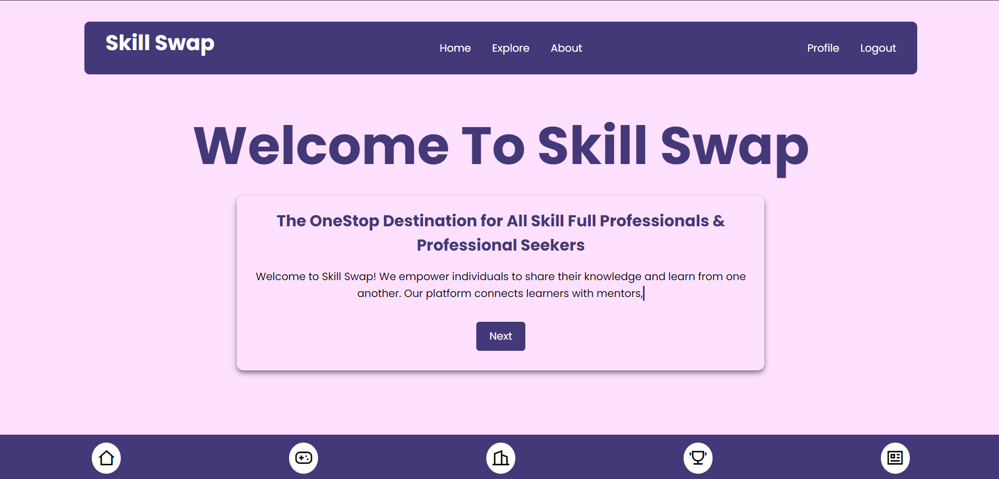

# Skill Swap - Monetize Your Expertise: Swap Skills for Success!



Skill Swap is an innovative platform designed to connect individuals seeking to share and learn skills collaboratively. In a world where knowledge is power, Skill Swap empowers users to not only offer their expertise but also gain new skills from others. By fostering a supportive community, we aim to create a space where learning and teaching go hand in hand, enhancing personal growth and promoting lifelong learning.

## Introduction

In today's fast-paced world, acquiring new skills has never been more important. Skill Swap addresses the challenges of traditional learning methods by providing a platform where users can engage with one another, facilitating the exchange of knowledge in a friendly and accessible environment. Whether you're looking to learn a new language, improve your coding skills, or explore a creative hobby, Skill Swap is here to help you on your journey.

## Theory Behind Skill Swap

The concept of Skill Swap is rooted in the idea that everyone has something valuable to teach and something valuable to learn. This peer-to-peer learning model encourages collaboration, reduces barriers to education, and fosters a sense of community among users. By connecting individuals with complementary skills, we create opportunities for personal and professional development, ultimately contributing to a more knowledgeable and skilled society.

## Features

- User registration and authentication
- Profile management
- Request and offer skills
- Dashboard for managing skills and requests
- User-friendly interface

## Installation

1. Clone the repository:
   ```bash
   git clone https://github.com/your-username/skill-swap.git
   ```
